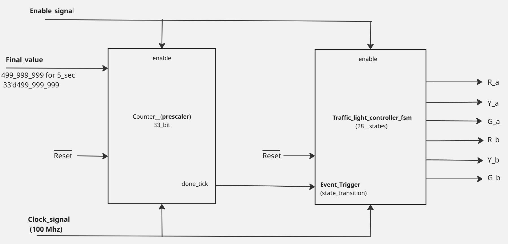
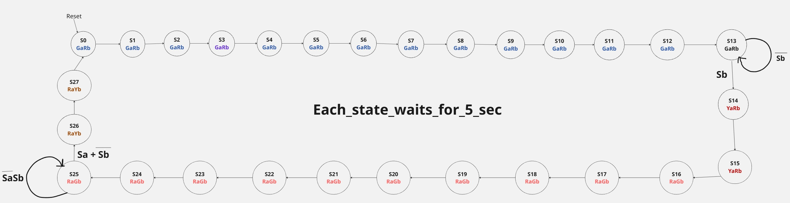
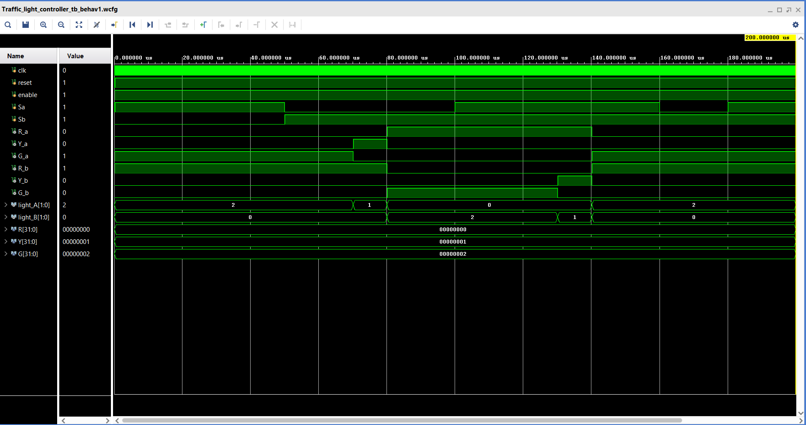

# 🚦 Traffic Light Controller - FSM Based | Verilog

**Author:** Amaan Sami  
**Last Updated:** July 2025

---

## 📌 Overview

This project implements a **Finite State Machine (FSM)** based **Traffic Light Controller** using **Verilog HDL**.  
It controls traffic flow at a four-way intersection:

- **Road A (East–West)** is given higher priority  
- **Road B (North–South)** is managed using vehicle sensors `Sa` and `Sb`

### ⏱ Timing Details

- Each **FSM state = 5 seconds** in real hardware (100 MHz clock)  
- **Total FSM states = 28**, so **one complete cycle = 140 seconds**  
- For simulation, each state = **5 microseconds** to accelerate testing

---

## ✅ Key Features

- 🔁 **28-state FSM** for realistic traffic timing  
- 🛑 Controls **Red, Yellow, Green** for both roads  
- 🎯 Intelligent control via sensor inputs `Sa` and `Sb`  
- 🔧 **Parameterizable tick counter**  
- 🧪 **Full-featured testbench** simulating real traffic cases  
- 📊 Generates **VCD waveform** for GTKWave

---

## ⚙️ Design Architecture

### 🧱 Block Diagram  


The system has two core components:

- **Tick Generator** – Generates periodic enable pulses (5s real / 5µs sim)  
- **FSM Controller** – 28-state machine handling signal transitions

---

## 🛠️ Module 1: `Traffic_light_controller.v`

### 📥 Inputs

| Signal | Direction | Description                        |
|--------|-----------|------------------------------------|
| clk    | Input     | 100 MHz system clock               |
| reset  | Input     | Active-low asynchronous reset      |
| enable | Input     | Master enable signal               |
| Sa     | Input     | Sensor on Road A (East–West)       |
| Sb     | Input     | Sensor on Road B (North–South)     |

### 📤 Outputs

| Signal      | Description              |
|-------------|--------------------------|
| R_a/Y_a/G_a | Lights for Road A        |
| R_b/Y_b/G_b | Lights for Road B        |

---

## 🎛 FSM State Diagram  


### ⏱ State Timings (5s per state in hardware)

| State Group     | States   | Duration | Road A | Road B |
|------------------|----------|----------|--------|--------|
| Road A Green      | S0–S13   | 70 sec   | Green  | Red    |
| Road A Yellow     | S14–S15  | 10 sec   | Yellow | Red    |
| Road B Green      | S16–S25  | 50 sec   | Red    | Green  |
| Road B Yellow     | S26–S27  | 10 sec   | Red    | Yellow |

---

## 🛠️ Module 2: `counter_tick_5_sec.v`

### 🧩 Parameterization

```verilog
parameter FINAL_VALUE = 33'd500_000_000  // 5 seconds at 100 MHz
```

> In simulation, use:

```verilog
.FINAL_VALUE(33'd500)  // 5 µs tick for faster testing
```

---

## 🧠 Why Use 28 FSM States?

- ⌛ Allows **exact time delays** via clock ticks  
- 🧠 Simplifies debugging with fine-grain transitions  
- 🔬 Supports detailed **waveform inspection**  
- 🧱 Scalable for adding more real-time logic  
- 🛡 Improves **real-world safety** simulation

---

## 🤖 Sample Sensor Logic

```verilog
S25: begin
    if (~Sa && Sb) q_next = S25;         // Hold if only Road B has vehicles
    else if (Sa || ~Sb) q_next = S26;    // Switch if A has traffic or B is clear
    else q_next = S25;
end
```

---

## 🔬 Testbench Simulation

### 🧪 Diagram  


### ✅ Test Scenarios

| Time (µs) | Sa | Sb | Description              |
|----------|----|----|--------------------------|
| 0–50     | 1  | 0  | Traffic on Road A        |
| 50–100   | 0  | 1  | Vehicle on Road B        |
| 100–160  | 1  | 1  | Both roads active        |
| 160–180  | 0  | 1  | Only Road B active       |
| 180–200  | 1  | 1  | Both active again        |

---

## ▶️ Simulation Instructions

```bash
# Compile
iverilog -o sim Traffic_light_controller.v Traffic_light_controller_tb.v

# Run
vvp sim

# View waveform
gtkwave traffic.vcd
```

> Include the following in testbench:
```verilog
$dumpfile("traffic.vcd");
$dumpvars;
```

---

## 📈 Expected Waveform Output

```
Time(µs) | Sa | Sb | Road A | Road B
------------------------------------
0–50     | 1  | 0  | Green  | Red
50–60    | 0  | 1  | Yellow | Red
60–110   | 0  | 1  | Red    | Green
110–120  | 1  | 1  | Red    | Yellow
120–170  | 1  | 1  | Green  | Red
... continues for full FSM cycle
```

---

## 📁 File Structure

```
├── Traffic_light_controller.v         # FSM Controller
├── counter_tick_5_sec.v               # Tick Generator
├── Traffic_light_controller_tb.v      # Testbench
├── README.md                          # This file
├── Traffic_light_controller_Block_Diagram.jpg
├── Traffic_light_controller_State_Diagram.jpg
└── Traffic_light_simulation.png       # Testbench simulation output
```

---

## 👨‍💻 Developed By

**Amaan Sami**  
Final Year ECE | MANIT Bhopal  
📧 amaansami2003@gmail.com  
📱 9752118446  

---

> \"Design realistic, test smartly. Simulate like it's hardware.\"
